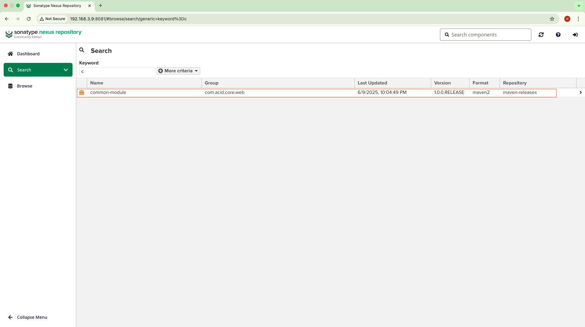

# Multi-Module Project and ACID framework.

 A multi-module Maven project is not the same as the ACID framework, but you can think of a multi-module Maven project in terms of modularity, reuse, and dependency management, similar to how ACID provides principles for managing reliable database transactions.

- **ACID** is about transaction integrity in databases: (Atomicity, Consistency, Isolation, Durability)  

- A **Multi-module** Maven project structures code into reusable, independently buildable, and maintainable modules.


**They don't directly map onto each other, but conceptually:**

- Atomicity: Modules build and fail independently, without breaking the entire build.

- Consistency: Ensures coherent versions and dependencies across modules.

- Isolation: Modules are clearly separated, isolated components with defined interfaces.

- Durability: Changes and artifacts are consistently available through repositories.

**Note:** A multi-module project focuses on code modularity and dependency management, while ACID principles focus on transactional integrity in databases.


# Common Web Module: A Spring Boot Library for Standardized Web Application Components

This library provides a comprehensive set of reusable components for Spring Boot web applications, focusing on pagination, authentication, and auditing capabilities. It streamlines the development of enterprise Java applications by offering standardized implementations of common web application patterns.

The module includes robust implementations for JWT authentication, pagination with customizable page sizes, and entity auditing with user tracking. It leverages Spring Boot's core capabilities while providing additional utilities for building secure, scalable web applications. The library is designed to be easily integrated into existing Spring Boot projects and provides a consistent approach to handling common web application concerns.

## Repository Structure
```
common-module/
├── build.gradle                 # Gradle build configuration with Spring Boot 3.2.2 and Java 17
├── gradle/wrapper/             
│   └── gradle-wrapper.properties # Gradle wrapper configuration
├── src/main/java/com/acid/core/web/
│   ├── AcidService.java         # Core service implementation
│   ├── constants/               # Shared constants for API and pagination
│   ├── model/                   # Data models and response objects
│   │   ├── ApiResponse.java     # Standardized API response wrapper
│   │   ├── audit/              # Auditing support for entity tracking
│   │   └── JwtAuthenticationResponse.java # JWT authentication response model
└── settings.gradle             # Gradle project settings
```

## Usage Instructions
### Prerequisites
- Java Development Kit (JDK) 17 or higher
- Gradle 7.x or higher
- Spring Boot 3.2.2 compatible project

Required dependencies:
```groovy
implementation 'org.springframework.boot:spring-boot-starter-web'
implementation 'org.springframework.boot:spring-boot-starter-security'
implementation 'io.jsonwebtoken:jjwt-api:0.11.2'
```

### Installation

1. Add the GitHub Packages repository to your `build.gradle`:
```groovy
repositories {
    maven {
        name = "GitHubPackages"
        url = uri("https://maven.pkg.github.com/jithumajinu/common-module")
        credentials {
            username = project.findProperty("gpr.user") ?: System.getenv("USERNAME")
            password = project.findProperty("gpr.key") ?: System.getenv("GITHUB_TOKEN")
        }
    }
}
```

2. Add the dependency:
```groovy
implementation 'com.acid.core.web:common-module:2.0.0'
```

### Quick Start

Implement Pagination:
```java
@GetMapping("/items")
public ModelPage<Item> getItems(
    @RequestParam(defaultValue = "1") int page,
    @RequestParam(defaultValue = "10") int size) {
    
    return ModelPage.<Item>builder()
        .pageSize(size)
        .pageNumber(page)
        .content(items)
        .totalCount(totalCount)
        .build();
}
```

### More Detailed Examples

Using Audit Support:
```java
@Entity
public class MyEntity extends UserDateAudit {
    private String name;
    
    // Your entity fields
}
```

Debug Mode:
```java
logging.level.com.acid.core.web=DEBUG
```

## Data Flow

The module handles data flow through a layered architecture, processing requests from authentication through response generation.

```ascii
Client Request → JWT Auth → Business Logic → Audit → Response
     ↑                                                 ↓
     └─────────────── ApiResponse Wrapper ────────────┘
```

Key Component Interactions:
1. Authentication requests are processed through JWT filters
2. Business operations are audited automatically via AuditingEntityListener
3. Responses are wrapped in standardized ApiResponse objects
4. Pagination is handled through ModelPage implementation
5. All database operations are tracked with UserDateAudit

### Developer Note:

###### Step 1 : download nexus repository from https://www.sonatype.com/
How to run nexus in local
```java
unzip  nexus-3.80.0-06-mac-x86_64.tar.gz

Open terminal
Step1 : nexus-3.80.0-06-mac-x86_64/nexus-3.80.0-06/bin
Step2 : ./nexus run

Open browser: 
http://localhost:8081

OR (server machine IP)
http://192.168.3.9:8081/

```



#### Step 2 :  How to publish to Nexus

```java

   ./gradlew clean

   ./gradlew publishMavenJavaPublicationToLocalNexusRepository

```

#### Step 3 :  Consumer service : build.gradle

```java
repositories {
    mavenCentral()
    // Add local Nexus repository
    maven {
        url "http://192.168.3.9:8081/repository/maven-releases/"
        allowInsecureProtocol = true
        credentials {
            username = "admin"
            password = "xxxxxx"
        }
    }
}

dependencies {
    // Use local common-module during development
    implementation('com.acid.core.web:common-module:1.0.0.RELEASE')
    // Use remote common-module for production
    // implementation 'com.acid.core.web:common-module:1.0.0.RELEASE'
}

Ie, .Java class :  import com.acid.core.web.model.ApiResponse;

```


